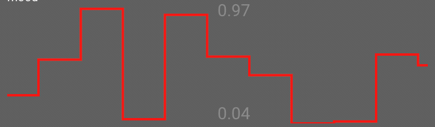

# StreamChart.js

Simple javascript library that plots realtime streamable data

## install:

```
yarn add @larskarbo/streamchart
```

## usage:

```
import StreamChart from '@larskarbo/streamchart'

const chart = new StreamChart(document.getElementByID("#div"))

setInterval(() => {
  chart.addValue(Math.random())
}, 100)
```

